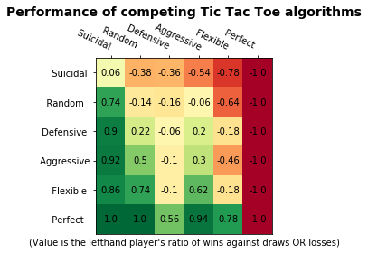
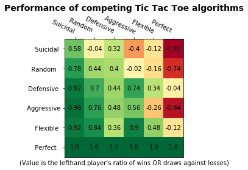

# tic-tac-toe-AIs
Implementation and comparison of six AI strategies for the game of tic-tac-toe.

A simple wrapper for the game of Tic-Tac-Toe, with 6 basic algorithms already included. I hope to use this program as a test metric for a later machine learning project.

At the moment, the AI strategies are:
 - Suicidal: Actively avoids winning the game as much as it can
 - Random: Makes random (legal) moves
 - Defensive: Makes random moves unless it is directly threatened with a loss in the next turn from 2-in-a-row
 - Aggressive: Makes random moves unless it can see an opportunity to win in the next turn with a 2-in-a-row
 - Flexible: Switches between the previous "Defensive" and "Aggressive" modes based on the situation
 - Perfect: A minimax algorithm with alpha-beta pruning that should in theory never lose a game
 
 A round-robin tournament gives the following matchup results:
 |Results|(36000 total games)|
 |:---:|:---:|
 | |   |
 |"Greedy" tournament (draws count as a loss)| "Safe" tournament (draws count as a win)|

Notes:
By and large the results are as you'd expect, although with a few interesting features.
 - Pleasingly the high-risk nature of the aggressive strategy is clear, as the aggressive AI does better against weak opponents than its defensive counterpart, but does significantly worse against the more robust defences of the Flexible and Perfect algorithms. 
  - The supposedly-"Suicidal" AI actually proved to be rather adroit at accidentally forcing draws, as it always tries to avoid making any game-deciding moves, as shown by its surprisingly (relatively) impressive record against the Defensive and Flexible algorithms
  - A clear player-one bias can be see by examining the primary diagonal, with every mirrormatch comfortably above the 0-point mark
